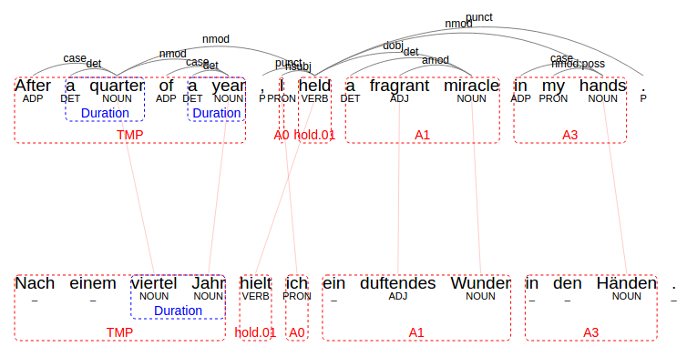
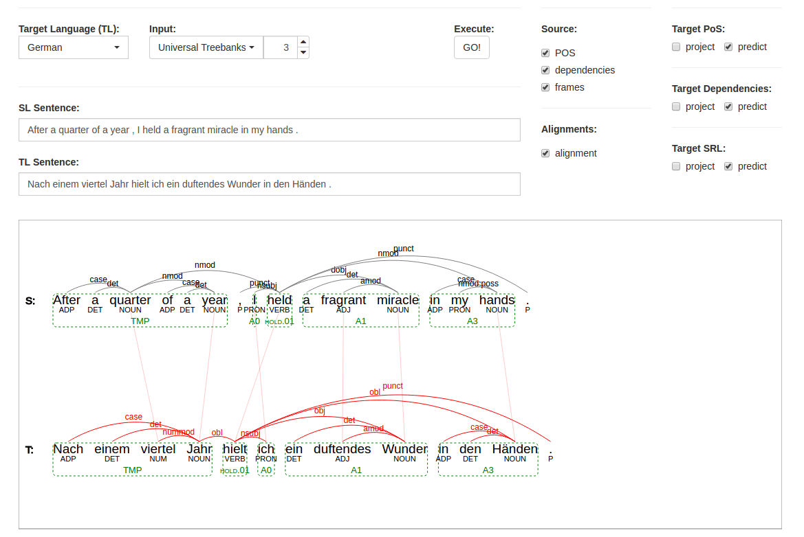

# ZAP - Multilingual Annotation Projection Framework

`ZAP` is a [Zalando](https://jobs.zalando.com/tech/) framework for **projection of linguistic annotation** in parallel corpora. The framework 
 enables us to **automaticallly generate linguistic resources (such as treebanks 
or propbanks) for new languages**, using a method referred to as *annotation projection* or *annotation transfer*. 

Below an example of an English (top) and German (bottom) sentence pair. English annotations are automatically 
projected onto the German sentence, labeling it with named entities, semantic roles and PoS tags.



## Included Components

The framework packages everything required to execute annotation projection in a set 
of very simple, lightweight Java methods. It includes: 

1. **Syntactic and Semantic Parsers**: We wrap open source libraries such as StanfordNLP, ANNA and Mate, so that syntactic parsing and
 semantic role labeling can be easily executed for all supported languages.
2. **Word Alignment**: We provide a heuristic alignment class that uses word translation probabilities computed for 
large-scale parallel corpora to automatically word-align sentence pairs in all supported language pairs.
3. **Annotation Transfer**: We provide an implementation of annotation transfer for a range of linguistic annotation,
 including part-of-speech tags, named entities, typed dependencies and semantic roles.
4. **Visualization**: We include a web-based UI called ``TheProjector``, 
useful for inspecting sentence alignments and annotation projection. 


This readme briefly illustrates their usage.

## Getting Started

### Dependencies

- Java 8
- Maven

### Installation

All you need to do is add this dependency to your project's `pom.xml` file:
```xml
<dependency>
    <groupId>zalando.analytics</groupId>
    <artifactId>zap</artifactId>
    <version>1.0-SNAPSHOT</version>
</dependency>
```
And you're set to get started!

## Usage

### Parse a sentence
We provide simple wrappers to enable you to quickly execute NLP tools to sentences in one of the supported languages.
To parse an English sentence, simply instantiate the PipelineWrapper object for English:  
  
```java
// create parsing pipeline object
PipelineWrapper pipeline = new PipelineWrapper(Language.ENGLISH);

// use pipeline to parse English sentence provided as string
Sentence parse = pipeline.parse("The big man ate a sandwich.");
```

### Parse a sentence in German
If you want to parse a sentence in another language, simply pass another Language enum to the constructor of the
 PipelineWrapper.
 
 ```java
// create parsing pipeline object
 PipelineWrapper pipeline = new PipelineWrapper(Language.GERMAN);
 
// use pipeline to parse German sentence provided as string
 Sentence parse = pipeline.parse("Wo sind all die Blumen hin ?");
 ```

### Create and align a bi-sentence

Bi-sentences are two sentences that are translations of one another and a core component in annotation projection.
First, instantiate a BiSentence object with a source and target language sentence. In this example, we parse only the 
source sentence and initialize the German target sentence without annotations (i.e. no PoS-tags, dependencies etc.).

```java
// create parsing pipeline object
PipelineWrapper pipeline = new PipelineWrapper(Language.ENGLISH);

// use pipeline to parse English sentence provided as string
Sentence sourceSentence = pipeline.parse("The big man ate a sandwich.");

// initialize German target sentence without annotations
Sentence targetSentence = Sentence.fromTokenized("Wo sind all die Blumen hin ?");

// create BiSentence object holding source and target Sentence
BiSentence biSentence = new BiSentence(sourceSentence, targetSentence);

```

Now you can use the HeuristicAligner to word-align both sentences. 

```java
// initialize aligner for English-German
HeuristicAligner aligner = HeuristicAligner.getInstance(Language.GERMAN); 

// align the BiSentence
biSentence.align(aligner);

// print alignment
System.out.println(biSentence)
```

If you print the alignment, you should get something like this:


### Project annotation in BiSentence

If you have completed the above steps to instantiate and word-align a BiSentence, you can use the AnnotationTransfer
class to transfer annotations from source to target sentence. 

```java
new AnnotationTransfer().transfer(biSentence);
```

Done! An annotated German sentence has been generated! You may print it in conll-u format by calling 

```java
System.out.println(biSentence.getSentenceTL().toConllU());
```


## Visualization and exploration

We include ``TheProjector``, a Web UI useful for inspecting sentence alignments and annotation projection. 
All you need to do is call the following method:

```java
TheProjectorUI.startServerAtPort(9000);
```

Then navigate your browser to ``localhost:9000``, where you should see the UI as indicated be the screenshot below.
Here, you can either select a corpus, or the manual mode to execute annotation projection. For more information on
``TheProjector``, refer to the following [paper](http://alanakbik.github.io/papers/EMNLP2017_demo_final.pdf).



## Contributing

Thanks for your interest in contributing! There are many ways to get involved; 
start with our [contributor guidelines](/CONTRIBUTING.md) and then 
check these [open issues](https://github.com/zalandoresearch/zap/issues) for specific tasks.

For contributors looking to get deeper into the API we suggest cloning the repository and checking out the unit 
tests for examples of how to call methods. Nearly all classes and methods are documented, so finding your way around 
the code should hopefully be easy.


## License

ZAP is in general licensed under the following MIT license: The MIT License (MIT) Copyright © 2017 Zalando SE, https://tech.zalando.com

Permission is hereby granted, free of charge, to any person obtaining a copy of this software and associated documentation files (the “Software”), to deal in the Software without restriction, including without limitation the rights to use, copy, modify, merge, publish, distribute, sublicense, and/or sell copies of the Software, and to permit persons to whom the Software is furnished to do so, subject to the following conditions:

The above copyright notice and this permission notice shall be included in all copies or substantial portions of the Software.

THE SOFTWARE IS PROVIDED “AS IS”, WITHOUT WARRANTY OF ANY KIND, EXPRESS OR IMPLIED, INCLUDING BUT NOT LIMITED TO THE WARRANTIES OF MERCHANTABILITY, FITNESS FOR A PARTICULAR PURPOSE AND NONINFRINGEMENT. IN NO EVENT SHALL THE AUTHORS OR COPYRIGHT HOLDERS BE LIABLE FOR ANY CLAIM, DAMAGES OR OTHER LIABILITY, WHETHER IN AN ACTION OF CONTRACT, TORT OR OTHERWISE, ARISING FROM, OUT OF OR IN CONNECTION WITH THE SOFTWARE OR THE USE OR OTHER DEALINGS IN THE SOFTWARE.

